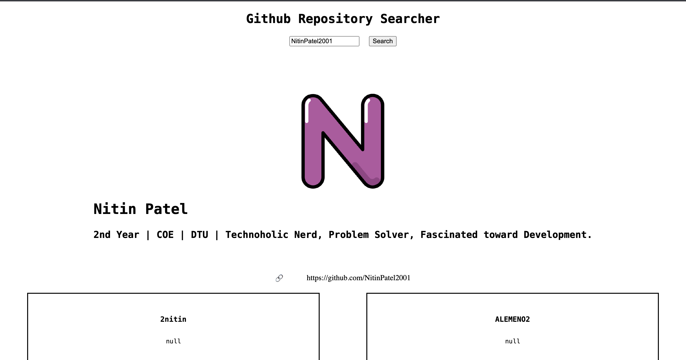

# Project Title

Repo_Searcher

## Demo Link

Access the Project at: https://nitinpatel2001.github.io/GithubSearcher/

## Table of Content

- About
- ScreeShot
- Technologies
- Setup for Local

## About

Repo_Searcher is a website that can be used to search repository of a specific user and this is developed using pure html, css, javascript and using fetch to get the data from GitHub API.

## ScreenShot

## Technologies

- HTML
- CSS
- Javascript
- Github API

## Setup for Local

- download or clone the repository
- Run the index.html HTML file into the browser.
